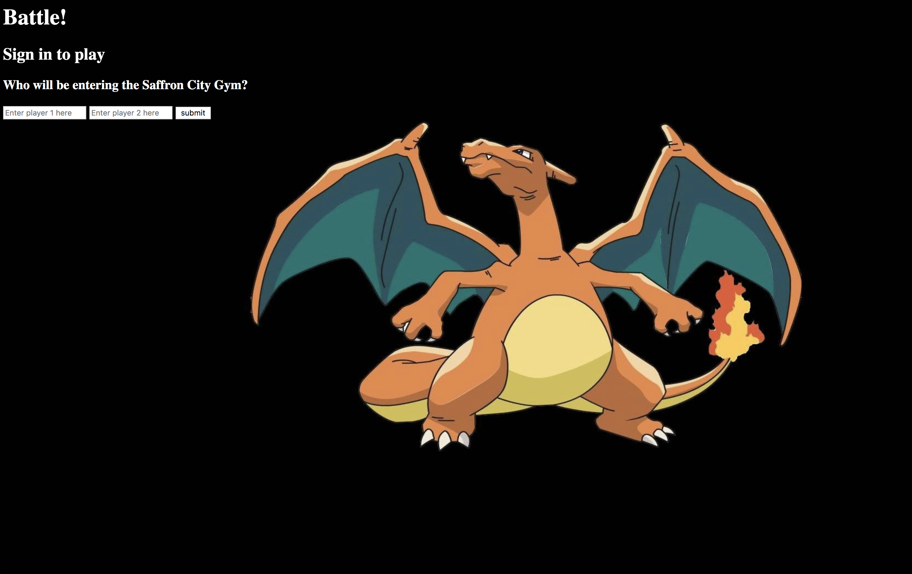
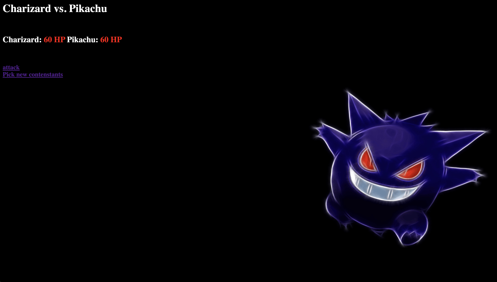

## Makers Academy - Week 3 Pair Programming Project

# Battle
=================

[Task](#Task) | [Installation](#Installation) | [User Stories](#User) | [Functionality](#Functionality) | [Testing](#Testing) | [Methods and Objects](#Methods) |

Technologies: Ruby, RSpec




## Task

Our task was to create a ruby web app that simulated a battle of your choice. My pair and I went for a pokemon battle as we felt this worked well with the functionality desired.

## Installation

1. Fork this repoistory and clone  it to your local machine then change into the directory

```
$ git clone git@github.com:tobydawson1/Battle
$ cd Battle
```

2. Load dependencies with bundle:

```
$ gem install bundle
$ bundle
```

3. Run the app on a local server 

```
ruby app.rb
```

## <a name="User"> User Stories </a>

```
As two Players,
So we can play a personalised game of Battle,
We want to Start a fight by entering our Names and seeing them
```

```
As Player 1,
So I can see how close I am to winning
I want to see Player 2's Hit Points
```

```
As Player 1,
So I can win a game of Battle,
I want to attack Player 2, and I want to get a confirmation
```

```
As Player 1,
So I can start to win a game of Battle,
I want my attack to reduce Player 2's HP by 10
```

```
As two Players,
So we can continue our game of Battle,
We want to switch turns
```

```
As Player 1,
So I can see how close I am to losing,
I want to see my own hit points
```

```
As Player 1,
So I can lose a game of Battle,
I want Player 2 to attack me, and I want to get a confirmation
```

```
As Player 1,
So I can start to lose a game of Battle,
I want Player 2's attack to reduce my HP by 10
```

```
As a Player,
So I can Lose a game of Battle,
I want to see a 'Lose' message if I reach 0HP first
```

## <a name="Functionality"> Functionality Descriptions</a>

The system's functionality includes:

* Two players can fill and submit a form to display their names.
* A player can click attack to reduce hit points from another player if it is their turn.
* A player can click OK after their attack to switch turns.
* A loser will be announced if their hit points reach 0.

## Testing

Tests were written with RSpec and Capybara. To run the tests in terminal:

```
$> cd Battle
$> rspec
```
